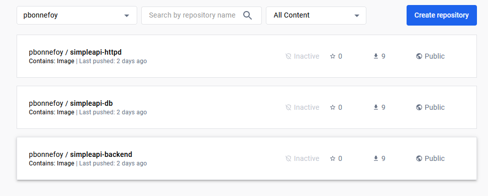
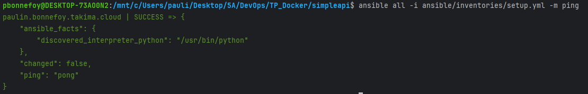
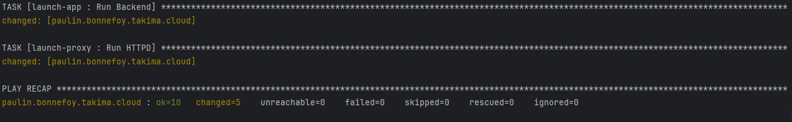

# Compte rendu de TP - DevOps

## 1 - Docker

### 1-1 Document your database container essentials: commands and Dockerfile.

On crée le Dockerfile en premier temps, avec nos variables d'environnement :

FROM postgres:14.1-alpine

ENV POSTGRES_DB=db \
POSTGRES_USER=usr \
POSTGRES_PASSWORD=pwd

Puis on ajoute le network :

`docker network create app-network`

On crée un adminer, qui nous permettra de visualiser nos données, en détaché et sur le network, exposé sur le port 8090 :

`docker run -p "8090:8080" --network=app-network --name=adminer -d adminer`

Enfin, on lance la base de donnée sur le même network :

`docker run -p 8888:5000 --name db —network app-network db`

On met les fichiers d'initialisation de la bdd dans le répertoire approprié de notre conteneur :

`COPY /initdb /docker-entrypoint-initdb.d`

Puis on ajoute des volumes, pour avoir de la persistance dans nos données :

`docker run -p 8888:5000 --name db -v /my/own/datadir:/var/lib/postgresql/data db`

### 1-2 Why do we need a multistage build? And explain each step of this dockerfile.

Les builds en plusieurs étapes sont utilisées pour optimiser les images Docker en séparant l'environnement de build de l'image de production finale. Cela réduit la taille de l’image finale et élimine les dépendances de construction inutiles.

On a donc séparé les étapes de construction en plusieurs lignes :

`FROM maven:3.8.6-amazoncorretto-17 AS myapp-build` donne l'image utilisé et lui donne un surnom.

`ENV MYAPP_HOME /opt/myapp` définit une variable d'environnement MYAPP_HOME, qui spécifie le répertoire personnel de l'application à l'intérieur du conteneur.

`WORKDIR $MYAPP_HOME` définit le répertoire de travail.

`COPY pom.xml .` copie le pom.xml dans le conteneur.

`COPY src ./src` copie le dossier src dans le conteneur.

`RUN mvn package -DskipTests` exécute Maven pour créer l'application. L'indicateur -DskipTests ignore l'exécution des tests. Cela crée un fichier JAR contenant l'application compilée.

`COPY --from=myapp-build $MYAPP_HOME/target/*.jar $MYAPP_HOME/myapp.jar` copie le fichier JAR généré lors de l'étape de construction précédente vers le répertoire /opt/myapp de l'image finale sous le nom « myapp.jar ». Il inclut uniquement les artefacts nécessaires dans l'image finale.

`ENTRYPOINT java -jar myapp.jar` spécifie la commande à exécuter au démarrage du conteneur. Ici, il exécute l'application Java avec la commande java -jar.

### 1-3 Document your docker-compose file.

Vous pouvez retrouver cette documentation dans le fichier [docker-compose.yml](docker-compose.yml)

### 1-4 Document docker-compose most important commands.

`docker compose up` est la commande la plus importante. Elle exécute le fichier docker-compose, donc crée les images et conteneurs nécessaires. 

`docker-compose down` est la seconde commande la plus importante. Elle arrête et supprime tous les conteneurs et images définis dans le fichier docker-compose.

### 1-5 Document your publication commands and published images in dockerhub.

On se login à dockerhub en premier lieu avec la commande `docker login`.

Une fois connecté, on utilise la commande `docker tag nom user/nom:version` afin de mettre un tag à notre image.
Ici : `docker tag db pbonnefoy/simpleapi-db:1.0.0`

Enfin, on push notre image sur dockerhub : `docker push pbonnefoy/simpleapi-db:1.0.0`

On peut retrouver ces images sur dockerhub par la suite : 

## 2 - Github action

### 2-1 What are testcontainers ?

Les test containers sont des bibliothèques Java qui permettent d'exécuter un certain nombre de conteneurs Docker pendant les tests.

### 2-2 Document your Github Actions configurations.

Vous pouvez retrouver cette documentation dans le fichier [main.yml](.github/workflows/main.yml)

### 2-3 Document your quality gate configuration.

On a créé un compte SonarCloud, puis une organisation dans ce dernier afin d'héberger notre projet.

Par la suite, nous avons pu récupérer un token d'identification de notre projet, lui-même dans notre organisation.
Ce token va être mis en variable secrête sur Github avec de pouvoir être utilisé dans notre projet.

Enfin, on modifie la ligne de commande pour build et tester notre projet dans le main.yml, avec la commande suivante :
`mvn -B verify sonar:sonar -Dsonar.projectKey=simpleapi-tpdevops_simpleapi -Dsonar.organization=simpleapi-tpdevops -Dsonar.host.url=https://sonarcloud.io -Dsonar.login=${{ secrets.SONAR_TOKEN }}  --file ./pom.xml`

Cela donne le résultat suivant :

## 3 - Ansible

### 3-1 Document your inventory and base commands.

On créé en premier lieu un fichier de setup pour notre ansible, que l'on stoque dans le dossier inventories.
Ce fichier, setup.yml, permet d'indiquer où nous définissons le serveur de déploiement et l'emplacement de la clé privée ssh.

On test le bon fonctionnement de ce fichier avec un ping :

Puis on demande au serveur d'obtenir la distribution de l'OS avec :
`ansible all -i inventories/setup.yml -m setup -a "filter=ansible_distribution*"`

Enfin, on supprime le serveur Apache httpd installé sur la machine :
`ansible all -i inventories/setup.yml -m yum -a "name=httpd state=absent" --become`

### 3-2 Document your playbook.

On a créé un playbook, [playbook.yml](ansible/playbook.yml), qui va nous permettre de donner les étapes à suivre.

On va ensuite pouvoir exécuter ce playbook, avec la commande `ansible-playbook -i ansible/inventories/setup.yml ansible/playbook.yml`

Dans cette commande, on indique le fichier à utiliser pour le setup, puis le fichier à exécuter.

On obtient un résultat (c'est celui de la partie d'après, mais cela revient au même) :

Enfin, on créé 5 rôles, un pour chaque tache que l'on va effectuer :
- Installation de docker
- Création du network
- Lancer la base de données
- Lancer le backend
- Lancer le proxy

Séparer en rôles permet d'isoler chaque'une des tâches, pour mieux comprendre notre code et faciliter son maniement.

### 3-3 Document your docker_container tasks configuration.

Vous pouvez retrouver cette documentation dans les fichiers du dossier [roles](ansible/roles)

Après avoir créé toutes ces tâches, on exécute le fichier playbook.yml pour déployer l'application sur paulin.bonnefoy.takima.cloud, mon serveur distant.

Pour exécuter le playbook, on utilise `ansible-playbook -i ansible/inventories/setup.yml ansible/playbook.yml`